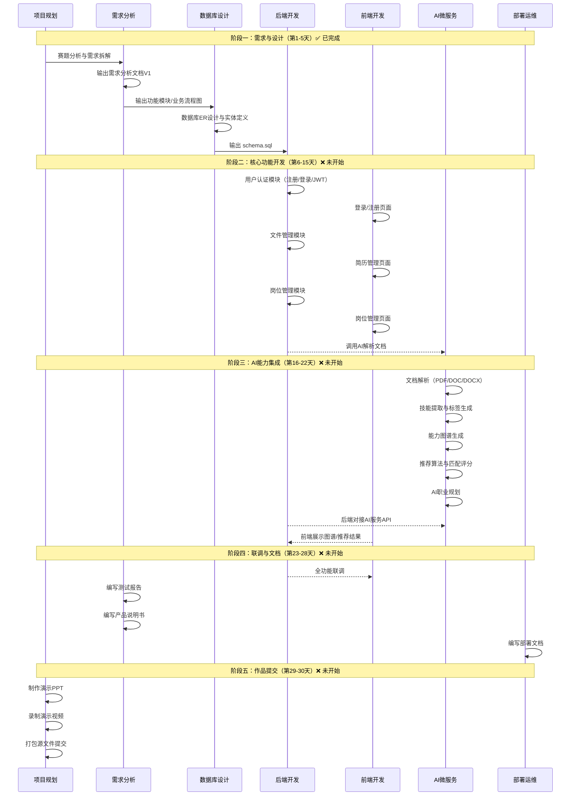

# 智聘星图系统开发流程时序图

```mermaid
sequenceDiagram
    participant PM as 项目规划
    participant RE as 需求分析
    participant DB as 数据库设计
    participant BE as 后端开发
    participant FE as 前端开发
    participant AI as AI微服务
    participant DEP as 部署运维

    Note over PM,DEP: 阶段一：需求与设计（第1-5天）✅ 已完成
    PM->>RE: 赛题分析与需求拆解
    RE->>RE: 输出需求分析文档V1
    RE->>DB: 输出功能模块/业务流程图
    DB->>DB: 数据库ER设计与实体定义
    DB->>BE: 输出 schema.sql

    Note over PM,DEP: 阶段二：核心功能开发（第6-15天）❌ 未开始
    BE->>BE: 用户认证模块（注册/登录/JWT）
    FE->>FE: 登录/注册页面
    BE->>BE: 文件管理模块
    FE->>FE: 简历管理页面
    BE->>BE: 岗位管理模块
    FE->>FE: 岗位管理页面
    BE-->>AI: 调用AI解析文档

    Note over PM,DEP: 阶段三：AI能力集成（第16-22天）❌ 未开始
    AI->>AI: 文档解析（PDF/DOC/DOCX）
    AI->>AI: 技能提取与标签生成
    AI->>AI: 能力图谱生成
    AI->>AI: 推荐算法与匹配评分
    AI->>AI: AI职业规划
    BE-->>AI: 后端对接AI服务API
    FE-->>BE: 前端展示图谱/推荐结果

    Note over PM,DEP: 阶段四：联调与文档（第23-28天）❌ 未开始
    BE-->>FE: 全功能联调
    RE->>RE: 编写测试报告
    RE->>RE: 编写产品说明书
    DEP->>DEP: 编写部署文档

    Note over PM,DEP: 阶段五：作品提交（第29-30天）❌ 未开始
    PM->>PM: 制作演示PPT
    PM->>PM: 录制演示视频
    PM->>PM: 打包源文件提交
```

> **当前进度：** 第3周（计划第21天），实际已完成需求分析与设计阶段，即将进入核心功能编码阶段。
