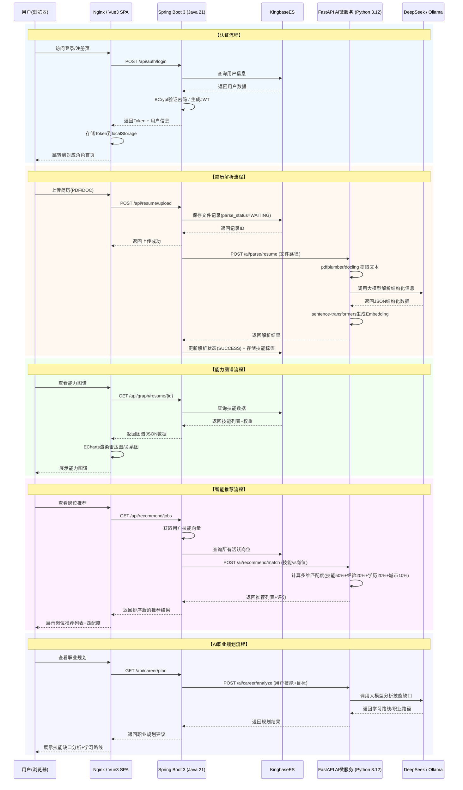

# 智聘星图系统架构时序图

```mermaid
sequenceDiagram
    participant User as 用户(浏览器)
    participant FE as Nginx / Vue3 SPA
    participant BE as Spring Boot 3 (Java 21)
    participant DB as KingbaseES
    participant AI as FastAPI AI微服务 (Python 3.12)
    participant LLM as DeepSeek / Ollama

    %% 用户认证流程
    rect rgb(240, 248, 255)
    Note over User,LLM: 【认证流程】
    User->>FE: 访问登录/注册页
    FE->>BE: POST /api/auth/login
    BE->>DB: 查询用户信息
    DB-->>BE: 返回用户数据
    BE->>BE: BCrypt验证密码 / 生成JWT
    BE-->>FE: 返回Token + 用户信息
    FE->>FE: 存储Token到localStorage
    FE-->>User: 跳转到对应角色首页
    end

    %% 简历上传流程
    rect rgb(255, 248, 240)
    Note over User,LLM: 【简历解析流程】
    User->>FE: 上传简历(PDF/DOC)
    FE->>BE: POST /api/resume/upload
    BE->>DB: 保存文件记录(parse_status=WAITING)
    DB-->>BE: 返回记录ID
    BE-->>FE: 返回上传成功

    BE->>AI: POST /ai/parse/resume (文件路径)
    AI->>AI: pdfplumber/docling 提取文本
    AI->>LLM: 调用大模型解析结构化信息
    LLM-->>AI: 返回JSON结构化数据
    AI->>AI: sentence-transformers生成Embedding
    AI-->>BE: 返回解析结果
    BE->>DB: 更新解析状态(SUCCESS) + 存储技能标签
    end

    %% 能力图谱生成
    rect rgb(240, 255, 240)
    Note over User,LLM: 【能力图谱流程】
    User->>FE: 查看能力图谱
    FE->>BE: GET /api/graph/resume/{id}
    BE->>DB: 查询技能数据
    DB-->>BE: 返回技能列表+权重
    BE-->>FE: 返回图谱JSON数据
    FE->>FE: ECharts渲染雷达图/关系图
    FE-->>User: 展示能力图谱
    end

    %% 智能推荐流程
    rect rgb(255, 240, 255)
    Note over User,LLM: 【智能推荐流程】
    User->>FE: 查看岗位推荐
    FE->>BE: GET /api/recommend/jobs
    BE->>BE: 获取用户技能向量
    BE->>DB: 查询所有活跃岗位
    BE->>AI: POST /ai/recommend/match (技能vs岗位)
    AI->>AI: 计算多维匹配度(技能50%+经验20%+学历20%+城市10%)
    AI-->>BE: 返回推荐列表+评分
    BE-->>FE: 返回排序后的推荐结果
    FE-->>User: 展示岗位推荐列表+匹配度
    end

    %% AI职业规划流程
    rect rgb(245, 245, 255)
    Note over User,LLM: 【AI职业规划流程】
    User->>FE: 查看职业规划
    FE->>BE: GET /api/career/plan
    BE->>AI: POST /ai/career/analyze (用户技能+目标)
    AI->>LLM: 调用大模型分析技能缺口
    LLM-->>AI: 返回学习路线/职业路径
    AI-->>BE: 返回规划结果
    BE-->>FE: 返回职业规划建议
    FE-->>User: 展示技能缺口分析+学习路线
    end
```

> **说明：** 本时序图展示系统核心业务流程的详细调用链路，涵盖认证、简历解析、能力图谱、智能推荐和职业规划五大核心流程。
